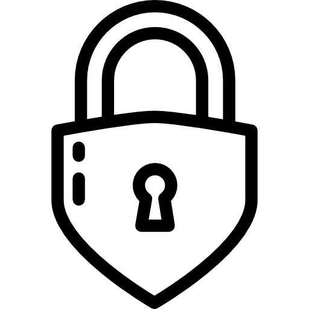

# WebSec Helper

**WebSec Helper** is a lightweight, privacy-friendly Chrome extension that gives you **real-time security hints** for any webpage you visit.  
It checks for HTTPS, secure cookies, and mixed-content issues — helping users stay aware of their browser security at a glance.


## Features

- Detects whether the website uses **HTTPS**  
- Warns about **insecure (HTTP)** connections  
- Checks for **secure cookies**  
- Detects **mixed content** (insecure resources on HTTPS pages)  
- Displays **friendly hints** to help users understand risks  


## How to Install & Test Locally

1. **Download or clone this repository**
```bash
   git clone https://github.com/alistairgeorge/websec-helper.git
```

2. Open Chrome and go to:

   ```
   chrome://extensions/
   ```

3. Turn on **Developer mode** (top right).

4. Click **Load unpacked** and select your websec-helper folder.

5. The lock 🔒 icon should appear in your toolbar.

6. Visit different websites and click the icon to see security hints in action.


## Folder Structure

```
websec-helper/
│
├── manifest.json          # Extension configuration
├── popup.html             # Popup interface
├── popup.js               # Frontend logic for the popup
├── background.js          # Background worker that analyses pages
│
└── icons/                 # Extension icons
    ├── lock16.png
    ├── lock48.png
    └── lock128.png
```

## manifest.json (configuration example)

```json
{
  "manifest_version": 3,
  "name": "WebSec Helper",
  "version": "1.0",
  "description": "Gives real-time security hints for any webpage.",
  "action": {
    "default_popup": "popup.html",
    "default_icon": {
      "16": "icons/lock16.png",
      "48": "icons/lock48.png",
      "128": "icons/lock128.png"
    }
  },
  "icons": {
    "16": "icons/lock16.png",
    "48": "icons/lock48.png",
    "128": "icons/lock128.png"
  },
  "permissions": ["activeTab", "scripting"],
  "background": {
    "service_worker": "background.js"
  }
}
```

## Icon Design

The WebSec Helper icons are minimal padlocks representing web safety and privacy.
They are resized versions of a clean flat-design lock:

| Size    | Use                    | Icon                          |
| - | - | -- |
| 16×16   | Toolbar icon           |     |
| 48×48   | Extensions menu        |     |
| 128×128 | Store listing / README |  |


## Test Scenarios

| Website                                 | Expected Result                      |
|                                         |                                      |
| `https://google.com`                    |  HTTPS detected — secure connection  |
| `http://example.com`                    |  Warning — insecure (HTTP) page      |
| `https://example.com/mixed.html`        |  Mixed content warning               |
| Page with cookies missing `Secure` flag | Cookie not secure                    |


## Future Roadmap

* [ ] Check for **CSP (Content Security Policy)** headers
* [ ] Add **phishing-domain alerts**
* [ ] Analyse **password fields and autocomplete** usage
* [ ] Export simple **security reports**


## Contributing

Pull requests and issues are welcome!
If you’d like to contribute new checks or UI improvements:

1. Fork the repository
2. Create a feature branch
3. Submit a pull request


## License

This project is open source under the **MIT License**.
You are free to use, modify, and distribute it with attribution.


